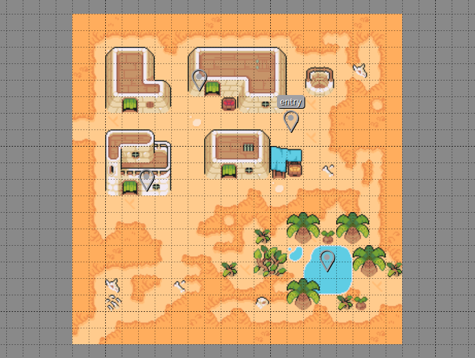
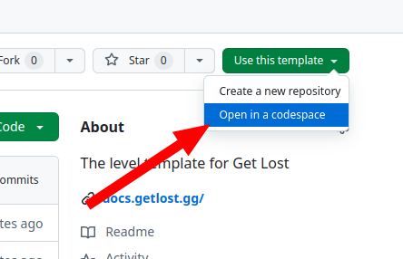
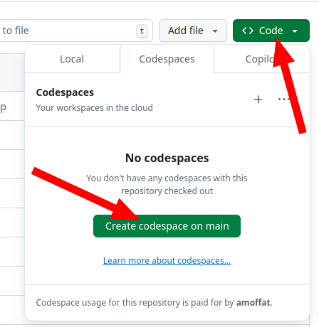

# Get Lost Level template

Welcome! This is a basic level template for the [Get Lost](https://x.com/GetLostTheGame) platform. It provides you with everything you need to start developing a level and playtesting it. Included is a sample map built with the incredible [CC0](https://creativecommons.org/public-domain/cc0/) asset pack [Ninja Adventure](https://pixel-boy.itch.io/ninja-adventure-asset-pack) from the French game dev brothers [Pixel Boy](https://x.com/2Pblog1).

[Full docs](https://docs.getlost.gg/latest/)

## To use this template

If you're reading this README directly from the `amoffat/getlost-level-template` template repo, scroll to the top of the page and click `Use this template` and select `Create a new repository`.

## To use the codespace

If you're reading this README from inside your codespace, or from a repo created from the [template repo](https://github.com/amoffat/getlost-level-template), follow these instructions. First, open your repo in a Codespace.

The Codespace will take a minute to fully load and open, but when it's done, you'll see a typical VSCode editor in the browser. Next, you'll want to navigate to the `ports` tab at the bottom.
